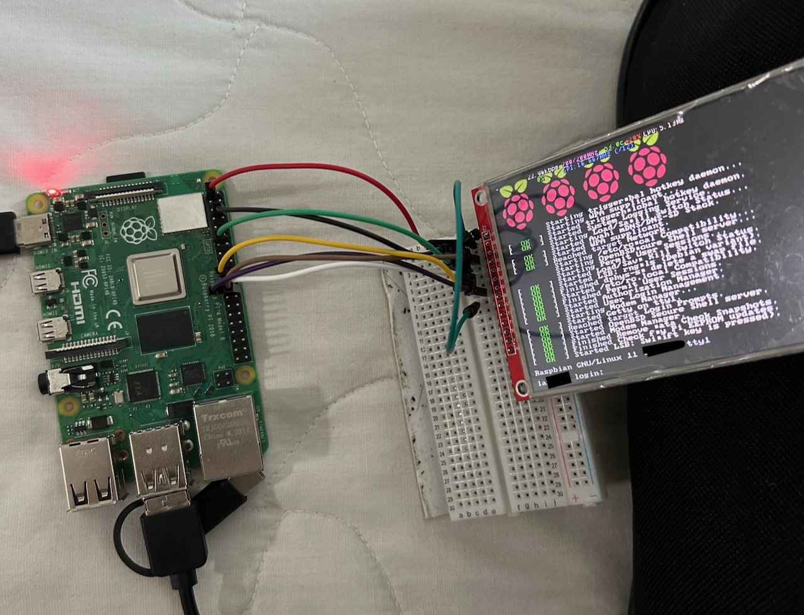

# ILI9488 Raspberry Pi Setup Script

This repository contains a script - `setup_ili9488.sh` - designed to simplify the setup of a 4" ILI9488 TFT screen commonly sold on AliExpress. This script configures the Raspberry Pi 4B to work seamlessly with the ILI9488 TFT display using the SPI interface.

To achieve this, the script integrates the configuration and logic provided by the [fbcp-ili9341 repository](https://github.com/juj/fbcp-ili9341.git), which is a game changer for setting up the framebuffer for SPI-based TFT displays. Make sure to clone and compile the `fbcp-ili9341` repository as part of the process.


I bought mine at XMKJ Store  
Link: https://www.aliexpress.com/item/1005005791515997.html?spm=a2g0o.order_list.order_list_main.5.47f91802b8PVtk

---

## 📌 Features

- Fully automates the setup of the ILI9488 TFT screen.
- Configures necessary system files (`config.txt` and `rc.local`).
- Automatically downloads and builds the `fbcp-ili9341` driver.
- Enables SPI and adjusts GPU memory for optimal performance.

---

## 🔌 Pinout for Connecting the TFT Display

### Required Connections
Connect your ILI9488 TFT screen to the Raspberry Pi 4B as follows:

| **TFT Pin** | **Description**       | **Raspberry Pi Pin** | **Pin Number** |
|-------------|-----------------------|-----------------------|----------------|
| **VDD**     | Power (VCC)           | 5V or 3.3V           | Pin 2 or Pin 1 |
| **GND**     | Ground                | Ground               | Pin 6          |
| **CS**      | Chip Select (SPI)     | GPIO 8               | Pin 24         |
| **RST**     | Reset                 | GPIO 17              | Pin 11         |
| **D/C**     | Data/Command (SPI)    | GPIO 25              | Pin 22         |
| **SDI**     | Serial Data In (MOSI) | GPIO 10              | Pin 19         |
| **SCK**     | Serial Clock (SPI)    | GPIO 11              | Pin 23         |
| **BL**      | Backlight             | 5V or GPIO 27        | Pin 2 or Pin 13 |




### Note:
- **VDD**: Use Pin 2 (5V) for brighter backlight or Pin 1 (3.3V) for power-saving mode.
- **BL (Backlight)**: For always-on backlight, connect to 5V (Pin 2). For GPIO-controlled backlight, use GPIO 27 (Pin 13).

---

## 📋 Step-by-Step Instructions

### 1️⃣ Install Git

Ensure `git` is installed on your Raspberry Pi:

```bash
sudo apt update
sudo apt install -y git
```

### 2️⃣ Download the Setup Script
Clone this repository to your Raspberry Pi:
```bash
git clone https://github.com/adamomd/ILI9488RPIScript.git
```

### 3️⃣ Run the Setup Script
Change to the script's directory, make it executable, and run it with root privileges:
```bash
cd ILI9488RPIScript
chmod +x setup_ili9488.sh
sudo ./setup_ili9488.sh
```

---

## 🔍 What Does the Script Do?
- **Updates the System**: Ensures your Raspberry Pi is up-to-date.
- **Installs Dependencies**: Downloads essential tools (git, cmake, etc.).
- **Enables SPI**: Automatically enables the SPI interface via raspi-config.
- **Builds fbcp-ili9341**: Downloads and builds the framebuffer driver for the ILI9488.
- **Modifies Configurations**:
  - Updates `/boot/config.txt` to set up display parameters.
  - Configures `/etc/rc.local` to start the display driver on boot.
- **Reboots**: Reboots the Raspberry Pi to apply changes.

---

## 🛠️ Troubleshooting

### Display not working?
1. Ensure connections match the pinout table above.
2. Run the setup script again to verify configuration:
   ```bash
   sudo ./setup_ili9488.sh
   ```
3. Check `/var/log/fbcp-ili9341.log` for errors.
4. Confirm SPI is enabled using `raspi-config`.

### Need to reconfigure?
Simply re-run the script:
```bash
sudo ./setup_ili9488.sh
```

---

## 🖱️ Just Copy and Paste

Copy and paste the commands below sequentially to prepare your Raspberry Pi, download the setup script, and execute it:

```bash
# Update and install git
sudo apt update
sudo apt install -y git

# Clone the setup script repository
git clone https://github.com/adamomd/ILI9488RPIScript.git

# Navigate to the script's directory
cd ILI9488RPIScript

# Make the script executable and run it
chmod +x setup_ili9488.sh
sudo ./setup_ili9488.sh
```

---


## 🌟 Feedback and Suggestions
We value your feedback! If you encounter issues or have suggestions, feel free to open an issue or contribute to the repository.

Happy Hacking!  
Script and Guide by AdamoMD
